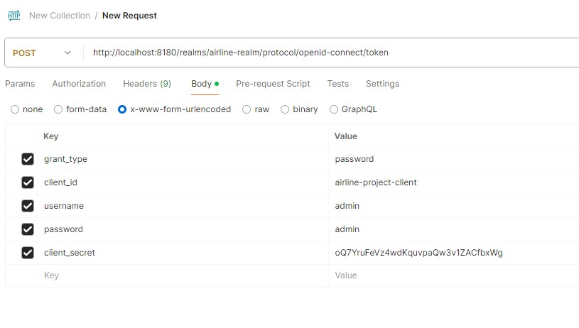
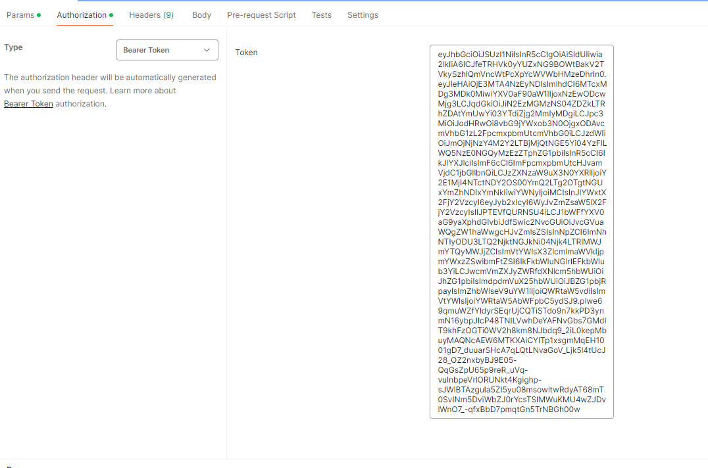
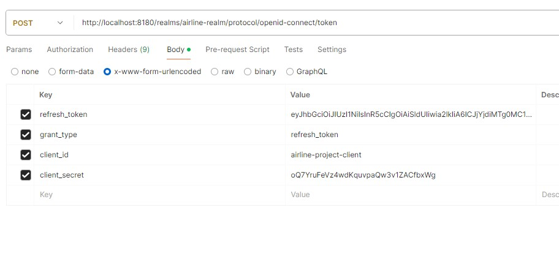

# Security

Для обеспечения безопасности и управления аутентификацией и авторизацией наше приложение использует Spring Security
который интегрирован с сервером авторизации Keycloak.
Конфигурация секьюрити находится в microservice-starter.
Включается / отключается секьюрность в методе configure.

## Keycloak

Keycloak - это сервер авторизации с открытым исходным кодом, который предоставляет функциональность аутентификации и авторизации.
В контексте нашего приложения, Keycloak используется для аутентификации пользователей и управления доступом к защищенным ресурсам.
Он позволяет нам делегировать процесс аутентификации и авторизации на сторону сервера. Можно думать о Keycloak как об отдельном микросервисе, 
написанном за нами, который разворачивается вместе с остальными приложениями, и к которому они обращаются для проверки пользователей. 

При запросе к закрытому ресурсу, юзера перебрасывает на страницу аутентификации в keycloak. После успешной аутентификации, keycloak выдает 
access token и refresh_token.

### Запуск
Keycloak запускается в docker контейнере вместе с базой данных командой <code>docker-compose -f docker-compose-kc.yml up</code>.
Консоль keycloak [тут](http://localhost:8180). Логин admin пароль admin.
База данных заполняется при запуске приложения двумя юзерами. admin/admin   user/manager

> Чтобы keycloak мог использовать данные пользователей из нашей базы данных, написан keycloak provider который при сборке образа копируется в контейнер. Все основные настройки keycloak находятся в realm-export.json, при запуске контейнера файл импортируются в keycloak.

Для получения токена, с помощью Postman сделать POST запрос на http://localhost:8180/realms/airline-realm/protocol/openid-connect/token 
в теле запроса передать данные как на скриншоте:
<code>grant_type:password
client_id:airline-project-client
username:admin
password:admin
client_secret:oQ7YruFeVz4wdKquvpaQw3v1ZACfbxWg</code>

Скопировать из ответа access_token и вставлять его при запросах к закрытым эндпоинтам. Время жизни токена 5 минут.
JWT токен себе содержит payload в котором могут передаваться данные пользователя, роли и тд. Декодировать токен можно [тут](https://jwt.io/).
Узнать подробнее про JWT [тут](https://habr.com/ru/articles/340146/).

Для получения нового токена, сделать запрос в котором передать refresh_token

